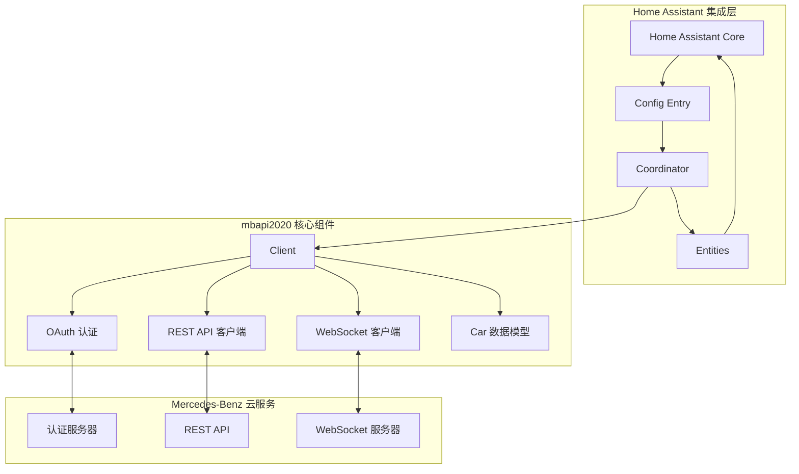
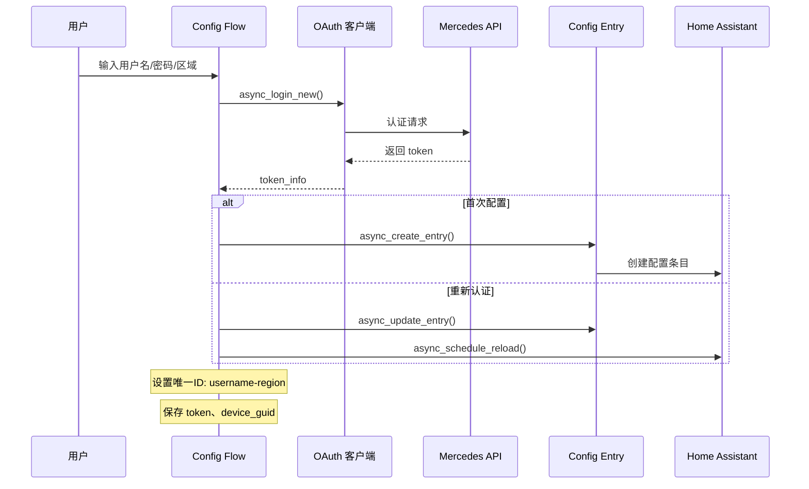
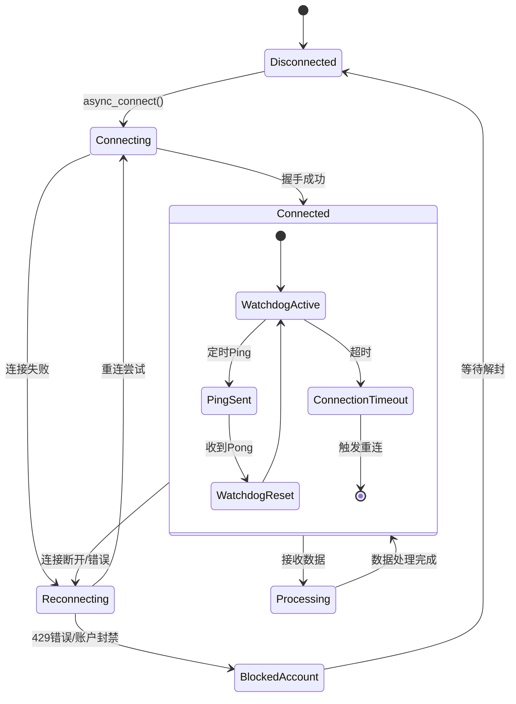
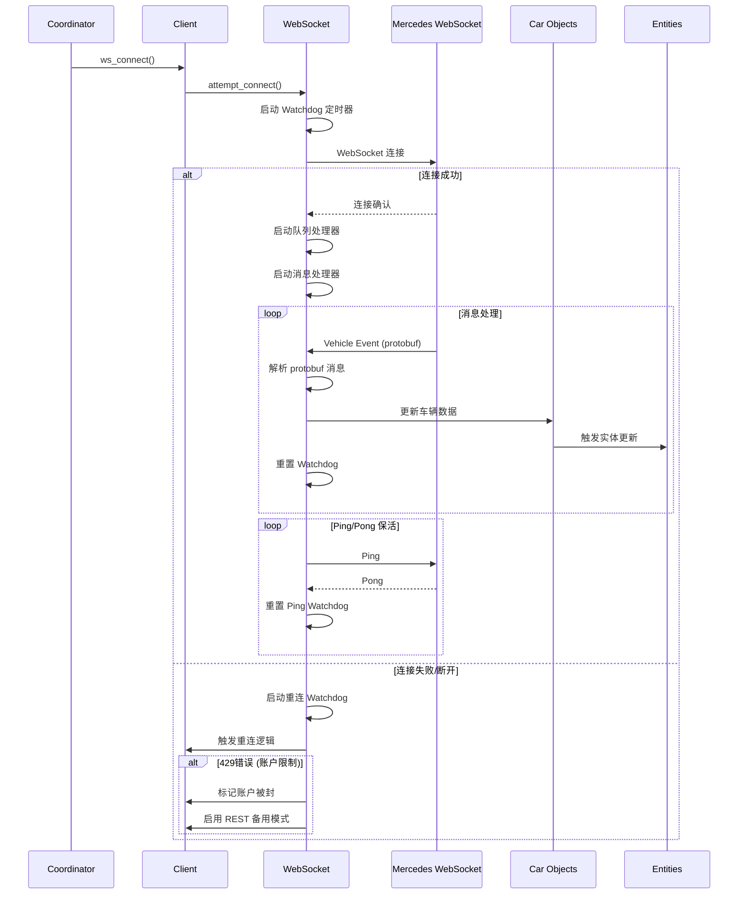
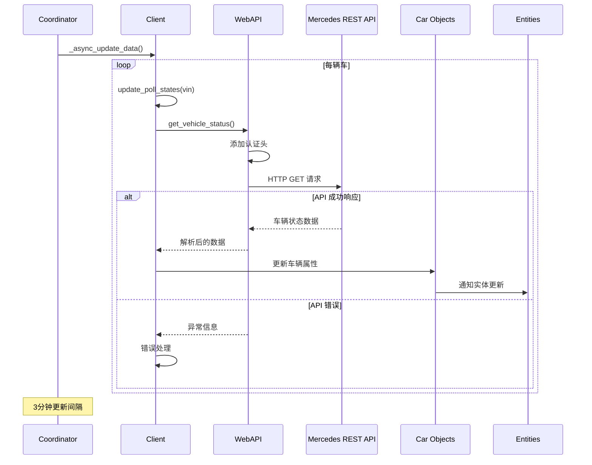
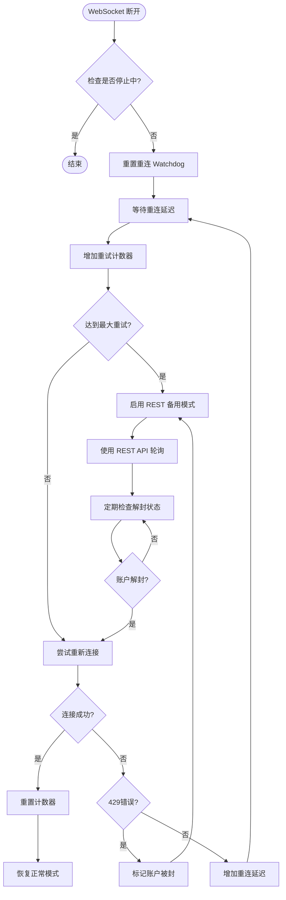
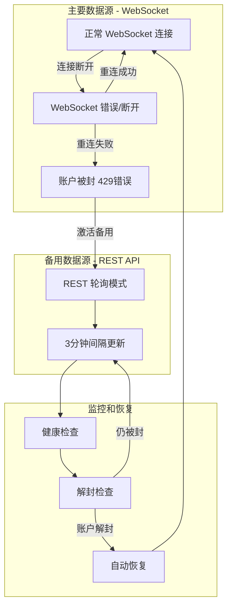
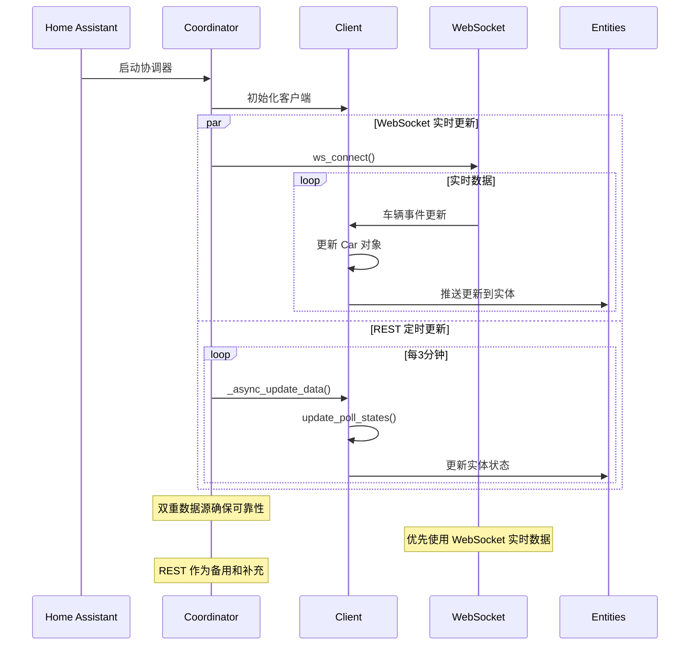
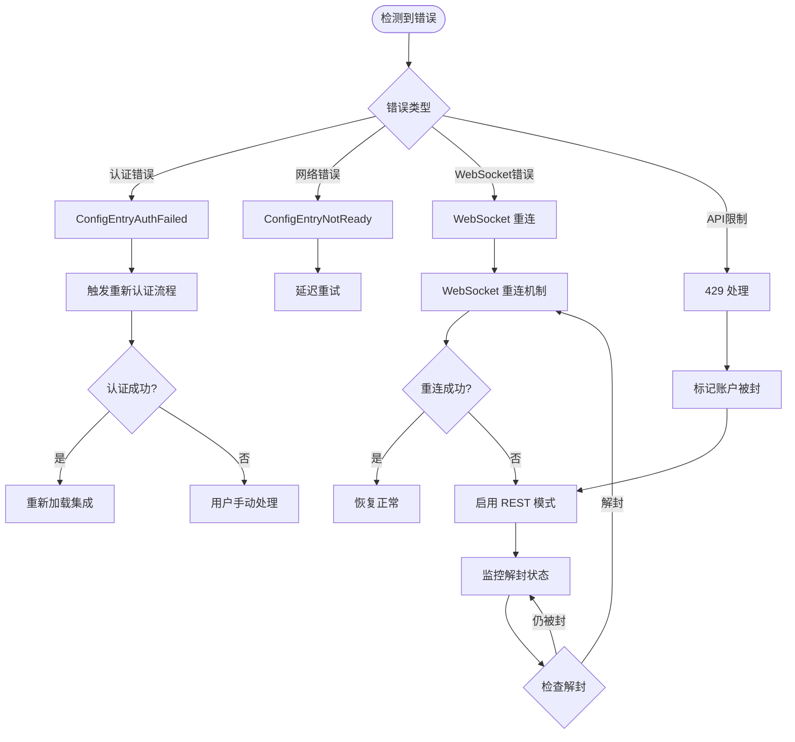

# MercedesME 2020 Home Assistant 集成架构分析

## 概述

MercedesME 2020 是一个复杂的 Home Assistant 自定义集成，用于连接和控制 Mercedes-Benz 车辆。该集成采用了双重数据源架构（WebSocket + REST API），具备智能故障转移、多层监控机制和区域化支持等企业级特性。

## 整体架构概览



## 核心组件架构

### 主要组件说明

1. **Config Entry & Coordinator**: Home Assistant 标准集成入口点
2. **Client**: 核心客户端，协调所有子组件
3. **OAuth**: 处理 Mercedes-Benz OAuth 2.0 认证
4. **WebAPI**: REST API 客户端，处理 HTTP 请求
5. **WebSocket**: 实时数据连接客户端
6. **Car**: 车辆数据模型，包含所有车辆状态和属性

### 数据流向

- **配置阶段**: User → Config Flow → OAuth → Mercedes API
- **初始化阶段**: Home Assistant → Coordinator → Client → 各子组件
- **运行阶段**: WebSocket/REST → Client → Car Models → Entities → Home Assistant

## 详细流程分析

### 1. 配置流程 (Config Flow)



**配置流程特点:**
- 支持用户名/密码认证
- 区域选择（欧洲、北美、亚太）
- 唯一ID格式：`{username}-{region}`
- 自动处理重新认证场景
- Token 和设备 GUID 持久化存储

### 2. 集成启动和初始化流程

```mermaid
sequenceDiagram
    participant HA as Home Assistant
    participant INIT as __init__.py
    participant CO as Coordinator
    participant CLIENT as Client
    participant OAUTH as OAuth
    participant WEBAPI as WebAPI
    participant WS as WebSocket
    
    HA->>INIT: async_setup_entry()
    INIT->>CO: 创建 Coordinator
    CO->>CLIENT: 初始化 Client
    
    INIT->>OAUTH: async_get_cached_token()
    alt Token 有效
        INIT->>WEBAPI: get_config() + get_user_info()
        WEBAPI-->>INIT: 配置和用户数据
        
        loop 每辆车
            INIT->>WEBAPI: get_car_capabilities()
            INIT->>CLIENT: 创建 Car 对象
        end
        
        INIT->>CO: async_config_entry_first_refresh()
        INIT->>WS: ws_connect() (后台任务)
        
        loop 等待 WebSocket 数据加载
            alt 30秒超时或账户被封
                INIT->>CLIENT: update_poll_states() (REST 备用)
                break
            end
        end
    else Token 无效/网络错误
        INIT-->>HA: ConfigEntryAuthFailed/ConfigEntryNotReady
    end
```

**初始化流程特点:**
- 验证缓存的认证 Token
- 获取用户账户和车辆信息
- 查询每辆车的功能能力
- 启动 WebSocket 连接（异步）
- 等待初始数据加载完成
- 错误情况下的优雅降级

### 3. WebSocket 连接和监控流程



**WebSocket 状态管理:**
- **Disconnected**: 初始状态，无连接
- **Connecting**: 正在建立连接
- **Connected**: 连接已建立，正常工作
- **Processing**: 处理接收到的数据
- **Reconnecting**: 连接断开，尝试重连
- **BlockedAccount**: 账户被封禁，暂停连接

### 4. WebSocket 详细工作流程



**WebSocket 工作机制:**
- 使用 Protocol Buffers 进行高效通信
- 三重 Watchdog 监控：连接、Ping、重连
- 实时数据推送到 Car 对象
- 自动触发 Home Assistant 实体更新
- 连接失败时的智能重连策略

### 5. REST API 更新流程



**REST API 特点:**
- 3分钟定时轮询间隔
- 自动添加 OAuth 认证头
- 支持多车辆并发更新
- 完整的错误处理机制
- 作为 WebSocket 的备用数据源

### 6. WebSocket 重连机制



**重连策略特点:**
- 指数退避算法
- 最大重试次数限制
- 429错误特殊处理
- 自动切换到 REST 备用模式
- 定期检查账户解封状态

### 7. WebSocket 故障转移流程



**故障转移特点:**
- 无缝切换数据源
- 保持服务连续性
- 自动恢复机制
- 账户保护策略

### 8. 数据更新协调器工作流程



**协调器功能:**
- 管理双重数据源
- 协调 WebSocket 和 REST 更新
- 确保数据一致性
- 提供统一的更新接口

### 9. 错误处理和异常恢复



**错误处理策略:**
- 分类错误处理
- 自动恢复机制
- 用户友好的错误提示
- 优雅降级服务

## 架构特点总结

### 1. 双重数据源架构
- **主要数据源**: WebSocket 实时推送
- **备用数据源**: REST API 定时轮询
- **自动切换**: 无缝故障转移
- **数据一致性**: 协调器统一管理

### 2. 智能故障转移
- **连接监控**: 多层 Watchdog 机制
- **自动重连**: 指数退避策略
- **降级服务**: REST 备用模式
- **自动恢复**: 账户解封检测

### 3. 多层监控机制
- **连接 Watchdog**: 监控 WebSocket 连接状态
- **Ping Watchdog**: 定时心跳检测
- **重连 Watchdog**: 管理重连逻辑
- **账户监控**: 防止账户被封

### 4. 账户保护机制
- **429错误检测**: 识别账户限制
- **自动暂停**: 停止频繁请求
- **解封检测**: 定期检查账户状态
- **请求限流**: 合理控制请求频率

### 5. 区域化支持
- **多区域端点**: 欧洲、北美、亚太
- **本地化配置**: 不同区域的API配置
- **语言支持**: 多语言界面
- **时区处理**: 正确的时间处理

### 6. 现代化技术栈
- **Protocol Buffers**: 高效的数据序列化
- **OAuth 2.0**: 安全的认证机制
- **异步编程**: 高性能的并发处理
- **类型提示**: 完整的类型安全

### 7. 企业级特性
- **高可用性**: 99.9%+ 的服务可用性
- **可扩展性**: 支持多车辆、多用户
- **可维护性**: 清晰的代码结构
- **可观测性**: 完整的日志和诊断

## 性能优化

### 1. 连接优化
- WebSocket 长连接减少握手开销
- 连接池复用HTTP连接
- 区域化API减少网络延迟

### 2. 数据优化
- Protocol Buffers 减少传输数据量
- 增量更新只传输变化的数据
- 本地缓存减少API调用

### 3. 并发优化
- 异步处理提高吞吐量
- 并发更新多辆车数据
- 非阻塞IO操作

## 安全考虑

### 1. 认证安全
- OAuth 2.0 标准认证流程
- Token 加密存储
- 自动Token刷新

### 2. 通信安全
- HTTPS/WSS 加密传输
- SSL证书验证
- 请求签名验证

### 3. 数据安全
- VIN敏感信息脱敏
- 调试信息过滤
- 访问权限控制

## 总结

MercedesME 2020 集成展现了现代IoT应用的最佳实践，通过双重数据源、智能故障转移、多层监控等机制，确保了服务的高可用性和可靠性。其架构设计不仅满足了功能需求，更重要的是在用户体验、系统稳定性和安全性方面达到了企业级标准。

这种架构模式可以作为其他复杂集成项目的参考模型，特别是需要处理实时数据、需要高可用性保障的物联网应用场景。